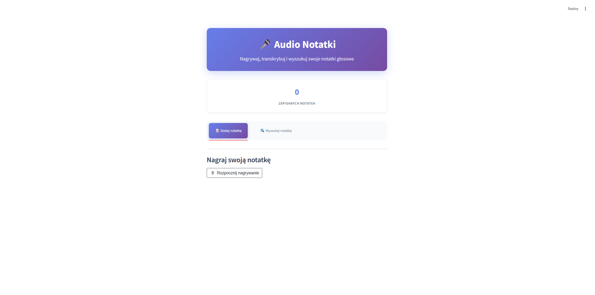

# 🎤 Audio Notes

## 📋 O projekcie

Audio Notes to proste narzędzie w Streamlit, które umożliwia nagrywanie głosu, automatyczną transkrypcję przy użyciu OpenAI Whisper oraz zapisywanie i przeszukiwanie notatek w wektorowej bazie Qdrant.


## 📱 Demo



## 📁 Struktura projektu

```
audio-notes/
├── app.py
├── requirements.txt
├── packages.txt
├── .env.example
├── .gitignore
├── .streamlit/
│   └── config.toml
│   └── secrets.toml
├── others/
│   └── audio-notes.png
├── README.md           
```
## ⚙️ Technologie
---

* **Python 3.11** – język programowania aplikacji

* **Streamlit** – framework do tworzenia interfejsu webowego

* **streamlit-audiorecorder** – komponent do nagrywania audio w przeglądarce

* **OpenAI Whisper API** – transkrypcja nagranego audio na tekst

* **OpenAI Embeddings API** (text-embedding-3-large) – generowanie wektorów z tekstu

* **Qdrant** – wektorowa baza danych do przechowywania i wyszukiwania notatek

* **python-dotenv** – wczytywanie zmiennych środowiskowych z pliku .env

* **hashlib (md5)** – generowanie sumy kontrolnej nagrania audio

* **io.BytesIO** – obsługa danych binarnych w pamięci

* **Pydantic / qdrant-client.models** – struktury danych do komunikacji z Qdrant

## 🛠️ Instalacja
---

   ```bash
   #Sklonuj repozytorium
   git clone https://github.com/skwarlinski/audio-notes.git
   cd audio-notes
   
   #Zainstaluj zależności
   pip install -r requirements.txt
   
   #Skonfiguruj zmienne środowiskowe
   cp .env.example .env
   #Edytuj plik .env i dodaj swoje klucze
   
   #Uruchom aplikację
   streamlit run app.py
   ```

## 🧠 Podejście i rozwiązania techniczne

Projekt implementuje kompleksowe podejście do tworzenia aplikacji konwersacyjnej:

1. **Architektura aplikacji** – aplikacja jest jednoplikowa (app.py), oparta na Streamlit, co pozwala na szybkie prototypowanie i prostą publikację w Streamlit Cloud.

2. **Nagrywanie audio w przeglądarce** – wykorzystano komponent streamlit-audiorecorder, który integruje interfejs nagrywania z mikrofonu bezpośrednio w aplikacji.

3. **Transkrypcja mowy** – audio jest wysyłane do API OpenAI Whisper (whisper-1), które zwraca tekst w formacie JSON, a następnie aplikacja umożliwia jego edycję przed zapisaniem.

4. **Reprezentacja semantyczna** – tekst notatki jest przekształcany w wektor osadzenia (embedding) przez model text-embedding-3-large z OpenAI, z wymiarem 3072, co umożliwia wyszukiwanie podobnych treści.

5. **Baza danych wektorowa** – do przechowywania i wyszukiwania notatek wykorzystano Qdrant Cloud, z konfiguracją kolekcji (rozmiar wektora, metryka COSINE) oraz obsługą API Key dla bezpieczeństwa.

6. **Wyszukiwanie semantyczne** – zapytania są również embedowane i porównywane w Qdrant, co pozwala znaleźć notatki o podobnej treści, nawet jeśli słowa nie są identyczne.

7. **Bezpieczeństwo kluczy** – klucze API (OpenAI, Qdrant) są przechowywane w .env lokalnie oraz w secrets.toml w Streamlit Cloud, aby nie były widoczne w kodzie źródłowym.

8. **Optymalizacja połączeń** – połączenie z Qdrant jest cache’owane `@st.cache_resource`, aby uniknąć wielokrotnego tworzenia klienta w trakcie działania aplikacji.

9. **Kontrola duplikatów audio** – generowany jest hash MD5 z nagrania, co pozwala odróżniać nowe nagrania od poprzednich i unikać zbędnych transkrypcji.

## 📬 Kontakt

Masz pytania lub sugestie? Odezwij się!

- 💼 [LinkedIn](https://www.linkedin.com/in/hubert-skwarlinski-895437368/)
- 💻 [GitHub](https://github.com/skwarlinski)
- ✉️ Email: [skwarlinskihubert@gmail.com](mailto:skwarlinskihubert@gmail.com)